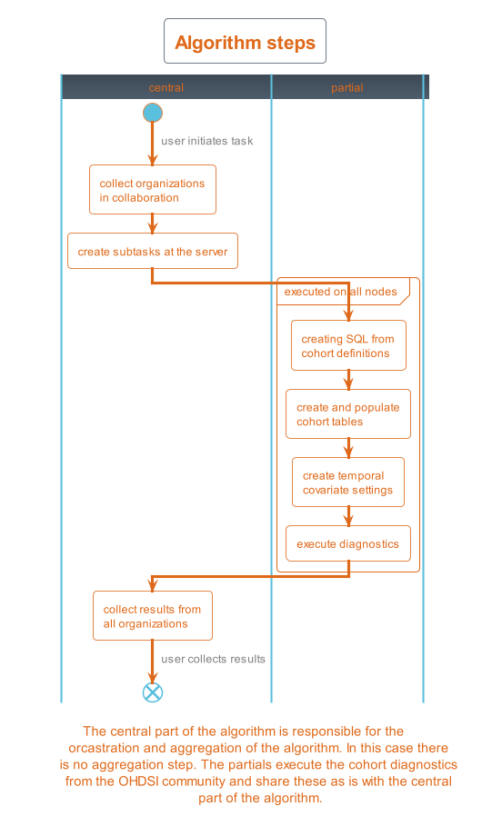

<h1 align="center">
  <br>
  <a href="https://vantage6.ai"></a>
</h1>

<h3 align=center>
    A Privacy Enhancing Technologies Operations (PETOps) platform
</h3>

--------------------

# OMOP Cohort Diagnostics
This algorithm is part of the [vantage6](https://vantage6.ai) solution.
Vantage6 allows to execute computations on federated datasets. This repository
contains the [OHDSI Cohort Diagnostics](https://ohdsi.github.io/CohortDiagnostics/)
algorithm.

This package has been developed in context of the
[BlueBerry](https://euracan.eu/registries/blueberry/) project.

## Adapted implementation
Please note: this version was adapted for use with a custom installation of Vantage6 (see the [Vantage6 deployment project](https://github.com/thehyve/vantage6-deployment)).
For this installation, the notes below may apply.

### Running the Python Client

This section describes how to set up and run the Python client (`client.py`) to execute OMOP cohort diagnostics tasks.

#### Prerequisites

- Python 3.8 or higher
- Access to a Vantage6 server
- Cohort definitions in JSON format (can be created using OHDSI ATLAS)

#### Setup Instructions

1. **Create a virtual environment** (recommended):
   ```bash
   # Create a new virtual environment
   python3 -m venv venv

   # Activate the virtual environment
   # On Linux/macOS:
   source venv/bin/activate
   # On Windows:
   venv\Scripts\activate
   ```

2. **Install required dependencies**:
   ```bash
   python -m pip install -r requirements.txt
   ```

3. **Set up environment variables** (see [Environment Variables Configuration](#environment-variables-configuration) section below for details):
   ```bash
   # Copy the template and customize it
   cp .env_prod .env
   # Edit .env with your configuration
   ```
    **Required Variables** (must be set, no defaults):

    | Variable | Description | Required |
    |----------|-------------|----------|
    | `V6_API_URL` | Vantage6 server URL | ✅ **Required** |
    | `V6_API_USER` | Username for authentication | ✅ **Required** |
    | `V6_API_PASSWORD` | Password for authentication | ✅ **Required** |
    | `COLLABORATION_ID` | ID of the collaboration (numeric) | ✅ **Required** |
    | `ORGANISATIONS_IDS` | Comma-separated list of organization IDs | ✅ **Required** |
    | `ALGORITHM_IMAGE` | Docker image for the algorithm | ✅ **Required** |

    **Optional Variables** (have default values):

    | Variable | Description | Default Value |
    |----------|-------------|---------------|
    | `V6_API_PORT` | Vantage6 server port | `443` |
    | `V6_API_PATH` | Vantage6 API path | `/server/api` |

    > **⚠️ Important**: The script will show an error and exit if any required variables are missing or empty. Make sure to set all required variables in your `.env` file or as environment variables.


4. **Prepare cohort definitions**:
   - Place your cohort definition JSON files (exported from ATLAS) in a `cohort_definitions/` directory or use the existing definitions provided in the repository.

#### Running the Client

Once everything is set up, you can run the client with various options:

**Basic usage** (results saved to `./results/cohort_diagnostics_results.zip`):
```bash
python client.py
```

**Specify custom output path**:
```bash
python client.py --output-path /path/to/your/results
```

**Specify custom output path and filename**:
```bash
python client.py --output-path /path/to/your/results --output-filename my_cohort_results.zip
```

**View all available options**:
```bash
python client.py --help
```

#### Command Line Parameters

| Parameter | Description | Default |
|-----------|-------------|---------|
| `--output-path` | Directory where results will be saved | `./results` |
| `--output-filename` | Name of the output ZIP file | `cohort_diagnostics_results.zip` |
| `--help` | Show help message and exit | - |

#### What the Client Does

1. **Loads environment variables** from your `.env` file
2. **Connects to the Vantage6 server** using your credentials
3. **Loads cohort definitions** from the `cohort_definitions/` directory
4. **Creates and submits a task** to the Vantage6 collaboration
5. **Waits for results** from all participating nodes
6. **Downloads and saves** the results as a ZIP file to your specified location

### Viewing results using OHDSI Diagnostics Explorer

The OHDSI Diagnostics Explorer is a Shiny application that provides an interactive interface for exploring cohort diagnostics results. This web-based tool allows you to visualize and analyze the diagnostic outputs generated by the cohort diagnostics algorithm.

#### What is the Diagnostics Explorer?

The Diagnostics Explorer helps you:
- **Review cohort definitions** and inclusion criteria
- **Examine cohort characteristics** across different databases
- **Identify potential issues** with cohort definitions
- **Compare cohorts** across different data sources
- **Assess data quality** and completeness
- **Generate reports** for stakeholders

**For more detailed information**, refer to the official OHDSI documentation:
https://ohdsi.github.io/CohortDiagnostics/articles/ViewingResultsUsingDiagnosticsExplorer.html

#### Prerequisites

Before launching the Diagnostics Explorer, ensure you have:
1. **R and RStudio installed** (R version 4.0 or higher recommended)
2. **Results from the client.py script** (ZIP file containing diagnostic outputs)

#### Step-by-Step Instructions

**Step 1: Install Required R Packages**

First, install the necessary R packages. Run the following commands in your R console:

```R
install.packages("remotes")
remotes::install_github("OHDSI/CohortDiagnostics@v3.2.5", dependencies=TRUE)
install.packages("usethis")
library(usethis)
```

**Step 2: Prepare Your Data**

1. **Navigate to your working directory** where `client.py` saved the results

> **Important**: The `dataFolder` parameter should point to the directory where `client.py` saved the results. If you used the default settings, this would be the `./results` folder.

```R
# Navigate to the directory with client.py results
setwd("/path/to/client_py/results")

# Load required libraries
library(shiny)
library(CohortDiagnostics)
```

**Step 3: Create Merged Results File**

The Diagnostics Explorer requires a merged results file that combines all diagnostic outputs:

```R
# Create merged results file from your extracted data
# The dataFolder should be the directory containing your client.py results
CohortDiagnostics::createMergedResultsFile(dataFolder='.', overwrite=TRUE)
```

**Step 4: Launch the Diagnostics Explorer**

Once the merged results file is created, launch the interactive application:

```R
# Launch the Diagnostics Explorer
CohortDiagnostics::launchDiagnosticsExplorer()
```

#### Using the Diagnostics Explorer

After launching the application, you can:

1. **Navigate through different tabs** to explore various aspects of your cohorts
2. **Filter results** by database, cohort, or other criteria
3. **Export visualizations** and tables for reports
4. **Compare cohorts** side-by-side
5. **Drill down into specific metrics** for detailed analysis

#### Troubleshooting

**Common Issues:**
- **"No data found"**: Ensure your `dataFolder` points to the correct directory with client.py results
- **Package installation errors**: Try installing packages individually and check for dependency conflicts
- **Shiny app won't launch**: Restart R session and try again
- **Missing visualizations**: Verify that all required diagnostic components were included in the original analysis


### Self-signed certificates
If you want to start this algorithm by running `client.py` and your installation uses self-signed certificates (mainly in case of local deployment), you need to make sure the environment variable `REQUESTS_CA_BUNDLE`
points to your certificate file, e.g. `export REQUESTS_CA_BUNDLE=/home/usr/path/to/cert.pem`

## Algorithm overview
<p align="center">
    
</p>

## Privacy Guards

### Minimum cell count
The minimum cell count for fields contains person counts or fractions. This is identical to the `minCellCount` parameter in the OHDSI package. You can set it using `CD_MIN_RECORDS`.

## Build
In order to build its best to use the makefile.

```bash
make image VANTAGE6_VERSION=4.10.2
```

## Node configuration
In order for this algorithm to run the vantage6 node needs to be properly
configured:

1. The algorithm containers need to be able to connect to the OMOP database.
   This seems trivial, but it is not as algorithm containers are completely
    isolated from the host machine.
2. The node configuration file needs to supply several additional parameters
   in order for the algorithm to create a connection to the OMOP database.

### 1. Attach OMOP database to the internal vantage6 network

#### Attach Docker container to the network
The easiest way is to attach the OMOP database container to the vantage6
network by adding the `docker_services` section in the node configuration file:

```yaml
# Containers that are defined here are linked to the algorithm containers and
# can therefore be accessed when by the algorithm when it is running. Note that
# for using this option, the container with 'container_name' should already be
# started before the node is started.
docker_services:
  container_label: container_name
```

Important to note is that this OMOP container should already be running prior
node start up.

#### Configure SSH tunnel to the Docker host
The second option is to configure an SSH tunnel to the Docker host. In this
case the OMOP database needs to listen on some port on the host machine. This
can either be in a Docker container or on the host machine itself. This can be
done by adding the `ssh_tunnel` section to the node configuration file:

```yaml
# Create SSH Tunnel to connect algorithms to external data sources. The
# `hostname` and `tunnel:bind:port` can be used by the algorithm
# container to connect to the external data source. This is the address
# you need to use in the `databases` section of the configuration file!
ssh-tunnels:

  # Hostname to be used within the internal network. I.e. this is the
  # hostname that the algorithm uses to connect to the data source. Make
  # sure this is unique and the same as what you specified in the
  # `databases` section of the configuration file.
  - hostname: my-data-source

    # SSH configuration of the remote machine
    ssh:

      # Hostname or ip of the remote machine, in case it is the docker
      # host you can use `host.docker.internal` for Windows and MacOS.
      # In the case of Linux you can use `172.17.0.1` (the ip of the
      # docker bridge on the host)
      host: host.docker.internal
      port: 22

      # fingerprint of the remote machine. This is used to verify the
      # authenticity of the remote machine.
      fingerprint: "ssh-rsa ..."

      # Username and private key to use for authentication on the remote
      # machine
      identity:
        username: username
        key: /path/to/private_key.pem

      # Once the SSH connection is established, a tunnel is created to
      # forward traffic from the local machine to the remote machine.
      tunnel:

        # The port and ip on the tunnel container. The ip is always
        # 0.0.0.0 as we want the algorithm container to be able to
        # connect.
        bind:
          ip: 0.0.0.0
          port: 8000

        # The port and ip on the remote machine. If the data source runs
        # on this machine, the ip most likely is 127.0.0.1.
        dest:
          ip: 127.0.0.1
          port: 8000
```

### 2. Add OMOP database to the node configuration file
The second step is to add the OMOP database to the node configuration file.
This can be done by adding the `databases` section to the node configuration
file:

```yaml
databases:
  - label: omop
    uri: jdbc:postgresql://[OMOP_HOSTNAME]:5454/postgres
    # Additional environment variables that are passed to the algorithm
    # containers (or their wrapper). This can be used to for usernames
    # and passwords for example. Note that these environment variables are
    # only passed to the algorithm container when the user requests that
    # database. In case you want to pass some environment variable to all
    # algorithms regard less of the data source the user specifies you can
    # use the `algorithm_env` setting.
    env:
      user: admin@admin.com
      password: admin
      dbms: postgresql
      cdm_database: postgres
      cdm_schema: public
      results_schema: results
```

The `env` section contains database specific parameters. The `dbms` parameter
is used to determine which database driver to use. The `cdm_database` and
`cdm_schema` parameters are used to determine which database and schema are
used for the OMOP CDM. The `results_schema` parameter is used to determine
which schema is used to store the results of the algorithm.

Make sure that the `uri` contains the correct `OMOP_HOSTNAME`, this depends on
wether you attached the OMOP database to the internal vantage6 network or
configured an SSH tunnel to the Docker host. In case you used the internal
vantage6 network, the `OMOP_HOSTNAME` is the same as the `container_label`. In
case you configured an SSH tunnel, the `OMOP_HOSTNAME` is the same as the
`hostname` in the `ssh-tunnels` section.


## Client / Usage
Make sure you have installed the vantage6 client, if you are unfamiliar with
the vantage6 client please read the
[documentation](https://docs.vantage6.ai/en/main/user/pyclient.html).

Lets first authenticate with the server:

```python
client = Client('http://127.0.0.1', 5000, '/api', log_level='debug')
client.authenticate('username', '***')

# insert the private key of your organization, only if the collaboration you
# are working in is encrypted.
client.setup_encryption(None)
```

Then we need to load the cohort definitions. In this example we used `*.json`
cohorts defined in the `local/` folder in this repository. These definitions
can be created and exported from the OHDSI
[ATLAS](https://github.com/OHDSI/Atlas) tool.

```python
# Load the cohort definitions from a folder. These can be created using the
# ATLAS tool
folder_ = Path(r".\local")
files = list(folder_.glob('*.json'))
omop_jsons = [(folder_ / file_).read_text() for file_ in files]
names = [file_.stem for file_ in files]
```

Then we define the
[python-ohdsi](https://python-ohdsi.readthedocs.io/en/latest/) function
arguments. For details on the arguments see the OHDSI documentation.

```python
# Create covariate settings
# To see all the available options please refer to the documentation of the
# OHDSI package: https://ohdsi.github.io/FeatureExtraction/reference/createTemporalCovariateSettings.html.
# Note that all arguments are converted from camelCase to snake_case
temporal_covariate_settings = {
    'use_demographics_gender': True,
    'use_demographics_age': True,
    'use_demographics_age_group': True,
    'use_demographics_race': True,
    'use_demographics_ethnicity': True,
    'use_demographics_index_year': True,
    'use_demographics_index_month': True,
    'use_demographics_index_year_month': True,
    'use_demographics_prior_observation_time': True,
    'use_demographics_post_observation_time': True,
    'use_demographics_time_in_cohort': True,
    'use_condition_occurrence': True,
    'use_procedure_occurrence': True,
    'use_drug_era_start': True,
    'use_measurement': True,
    'use_condition_era_start': True,
    'use_condition_era_overlap': True,
    'use_condition_era_group_start': False,  # do not use because https://github.com/ohdsi/feature_extraction/issues/144
    'use_condition_era_group_overlap': True,
    'use_drug_exposure': False,  # leads to too many concept id
    'use_drug_era_overlap': False,
    'use_drug_era_group_start': False,  # do not use because https://github.com/ohdsi/feature_extraction/issues/144
    'use_drug_era_group_overlap': True,
    'use_observation': True,
    'use_visit_concept_count': True,
    'use_visit_count': True,
    'use_device_exposure': True,
    'use_charlson_index': True,
    'use_dcsi': True,
    'use_chads2': True,
    'use_chads2_vasc': True,
    'use_hfrs': False,
    'temporal_start_days': [
        # components displayed in cohort characterization
        -9999,  # anytime prior
        -365,  # long term prior
        -180,  # medium term prior
        -30,  # short term prior
        # components displayed in temporal characterization
        -365,  # one year prior to -31
        -30,  # 30 day prior not including day 0
        0,  # index date only
        1,  # 1 day after to day 30
        31,
        -9999  # any time prior to any time future
    ],
    'temporal_end_days': [
        0,  # anytime prior
        0,  # long term prior
        0,  # medium term prior
        0,  # short term prior
        # components displayed in temporal characterization
        -31,  # one year prior to -31
        -1,  # 30 day prior not including day 0
        0,  # index date only
        30,  # 1 day after to day 30
        365,
        9999  # any time prior to any time future
    ]
}

# Execute cohort diagnostics settings
# To see all the available options please refer to the documentation of the
# OHDSI package: https://ohdsi.github.io/CohortDiagnostics/reference/executeDiagnostics.html
diagnostics_settings = {
    'run_inclusion_statistics': True,
    'run_included_source_concepts': True,
    'run_orphan_concepts': True,
    'run_time_series': False,
    'run_visit_context': True,
    'run_breakdown_index_events': False,
    'run_incidence_rate': True,
    'run_cohort_relationship': True,
    'run_temporal_cohort_characterization': True
}
```

Then we can create the task and submit it to the server:

```python
# Create the task
# Create a new vantage6 task that executes the cohort diagnostics at all the
# nodes that are part of the collaboration.
task = client.task.create(
    collaboration=1,
    organizations=[1],
    name='omop-test',
    description='@',
    input_={
        'method': 'central',
        'kwargs': {
            'cohort_definitions': omop_jsons,
            'cohort_names': names,
            'temporal_covariate_settings': temporal_covariate_settings,
            'diagnostics_settings': diagnostics_settings,
        }
    },
    databases=[{'label': 'default'}],
    image=****
)
```

Finally we can await and collect the results by:

```python
# Wait for the results
task_id = task.get('id')
results = client.wait_for_results(task_id=task_id)
```

## Read more
See the [vantage6 documentation](https://docs.vantage6.ai/) for detailed
instructions on how to install and use the server and nodes.


See [python-ohdsi documentation](https://python-ohdsi.readthedocs.io/) for more
information on the OHDSI packages.

------------------------------------
> [vantage6](https://vantage6.ai)
